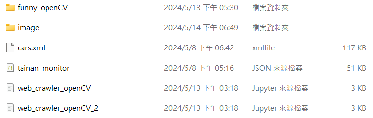
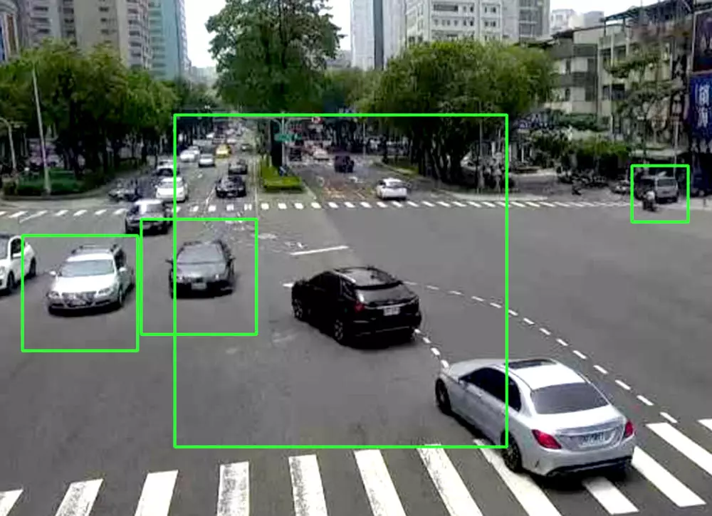

# OpenCV玩玩
這邊主要學習網路上範例並將其應用，主要是從Steam教育學習網學習，大家有興趣可以上去學習相關的OpenCV技術，老師挺活潑的~

## 第一部分汽車辨識
首先，我們先學習如何辨識車鍊的圖片，需要先去下載**cars.xml**並將他放在撰寫的**Python**同一個根目錄之下，如下圖。

 ### 車輛辨識
 ```python
import cv2
img = cv2.imread('cars.jpg')                    # 讀取街道影像
gray = cv2.cvtColor(img, cv2.COLOR_BGR2GRAY)    # 轉換成黑白影像

car = cv2.CascadeClassifier("cars.xml")    # 讀取汽車模型
gray = cv2.medianBlur(gray, 5)                  # 模糊化去除雜訊
cars = car.detectMultiScale(gray, 1.1, 3)       # 偵測汽車
for (x, y, w, h) in cars:
    cv2.rectangle(img, (x, y), (x+w, y+h), (0, 255, 0), 2)   # 繪製外框

cv2.imshow('oxxostudio', img)
cv2.waitKey(0) # 按下任意鍵停止
cv2.destroyAllWindows()
```
在**Steam教育學習網學習**都有詳細的註解出那些部分是在做甚麼的，主要是用**cv2**將圖片讀取進來後轉換成黑白影像，然後讀取模型的參數，將讀取的圖片模糊處理，最後模糊化，然後設定要追蹤的歪框大小以及參數，那大家執行完按**q**就能夠退出**cv2**羅，不要傻傻跟我一樣一直按ESC哈哈哈，成果會如下圖：

可愛的車子就這樣偵測到羅~
## 第二部分人臉偵測
這個部分來學習怎麼樣偵測臉的部分，以及將動態追蹤，這個部分要另外下載**haarcascade_frontalface_default**一樣放置在**PythonU**根目錄下，這邊的話就跳過偵測單張相片的部分，直接進入到動態偵測，動態偵測的邏輯只是運用單張的方式，將每一禎轉換成圖片加以辨識。
```python
import cv2
cap = cv2.VideoCapture(0)
face_cascade = cv2.CascadeClassifier("haarcascade_frontalface_default.xml")
faces = face_cascade.detectMultiScale(gray)
if not cap.isOpened():
    print("Cannot open camera")
    exit()
while True:
    ret, frame = cap.read()
    if not ret:
        print("Cannot receive frame")
        break
    frame = cv2.resize(frame,(540,320))              # 縮小尺寸，避免尺寸過大導致效能不好
    gray = cv2.cvtColor(frame, cv2.COLOR_BGR2GRAY)   # 將鏡頭影像轉換成灰階
    faces = face_cascade.detectMultiScale(gray)      # 偵測人臉
    for (x, y, w, h) in faces:
        cv2.rectangle(frame, (x, y), (x+w, y+h), (0, 255, 0), 2)   # 標記人臉
    cv2.imshow('oxxostudio', frame)
    if cv2.waitKey(1) == ord('q'):
        break
cap.release()
cv2.destroyAllWindows()
```
透過上面的註解，一樣是透過**cv2**讀取影像以及讀取**haarcascade_frontalface_default.xml**模型參數，這邊比較特別的是透過迴圈的方式將讀取的影像轉為圖片，並且用迴圈的方式執行，當影像不段讀取的時候不段的偵測以及轉換，直到點擊**q**退出迴圈，但特別的是將圖片偵測大小縮小了，主要是降低偵測到其他物件，提升準確率。成果為以下：

這邊跟老師借一下GIF，如有冒犯會將GIF立刻下架，感謝老師了。
## 第三部分動態車輛偵測
我們學會了怎麼樣偵測車輛的圖片、人臉的動態偵測，那接下來就將兩者合併吧。
### 用Request的方式讀取監視器
```python
import cv2
url = 'https://soa.tainan.gov.tw/Mjpeg?name=TNCCTVNEW&positionCol=Location&positionName=%E5%B0%8F%E6%9D%B1%E8%B7%AF%E8%88%87%E4%B8%AD%E8%8F%AF%E6%9D%B1%E8%B7%AF%E4%B8%80%E6%AE%B5%E5%8F%A3%E5%8C%97%E6%A1%BF(%E5%90%91%E5%8D%97)&urlCol=url'
url2 = 'https://soa.tainan.gov.tw/Mjpeg?name=TNCCTVNEW&positionCol=Location&positionName=%E6%B0%91%E6%97%8F%E8%B7%AF%E4%B8%80%E6%AE%B5%E8%88%87%E5%89%8D%E9%8B%92%E8%B7%AF%E5%8F%A3%E8%A5%BF%E6%A1%BF(%E5%90%91%E6%9D%B1)&urlCol=url'
cap = cv2.VideoCapture(url2) 
car = cv2.CascadeClassifier("cars.xml")
```
這邊的話我去取台南市的公共監視器，大家可以去政府資料公開平台查找相關的監視器來換也可以，只要把**URL**改成自己的就好，但看完之後覺得身活好裸露到處都有監視器哈哈哈。
### 結合動態偵測以及車輛辨識
```python
if not cap.isOpened():
    print("Cannot open camera")
    exit()
while True:
    ret, frame = cap.read()
    if not ret:
        print("Cannot receive frame")
        break
    gray = cv2.cvtColor(frame, cv2.COLOR_BGR2GRAY)   # 將鏡頭影像轉換成灰階
    gray = cv2.medianBlur(gray, 7)                  # 模糊化去除雜訊
    cars = car.detectMultiScale(gray, 1.1, 5)       # 偵測汽車
    for (x, y, w, h) in cars:
        cv2.rectangle(frame, (x, y), (x+w, y+h), (0, 255, 0), 2)   # 繪製外框
    cv2.imshow('oxxostudio', frame)
    if cv2.waitKey(1) == ord('q'):
        break
cap.release()
cv2.destroyAllWindows() 
```
這邊的話只是將辨識人臉的模型改成車輛的模型去偵測車輛，然後偵測的影像是用公共監視器而已，大家可以嘗試看看，基本上跟人臉辨識一模一樣喔!!

可以發現成果的準確率其實很低，有時候會偵測到機車，汽車的準度也不;高主要是這個模型訓練的圖片是用白天的圖片，另外就是每個應用的方式都應該Train新的模型來使用，如果要提高準確率的話當然就是將監視器畫面轉成圖片下去訓練，並調整參數，有興趣的人可以試試看~
# 參考文章
* [OpenCV 汽車偵測](https://steam.oxxostudio.tw/category/python/ai/ai-cars-dectection.html)
* [OpenCV 人臉偵測](https://steam.oxxostudio.tw/category/python/ai/ai-face-dectection.html)
